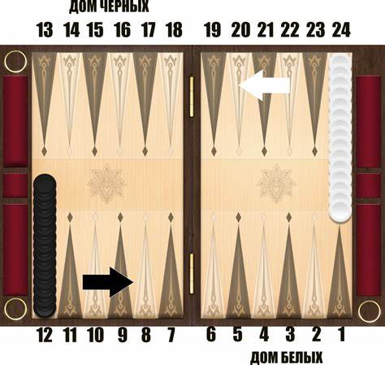
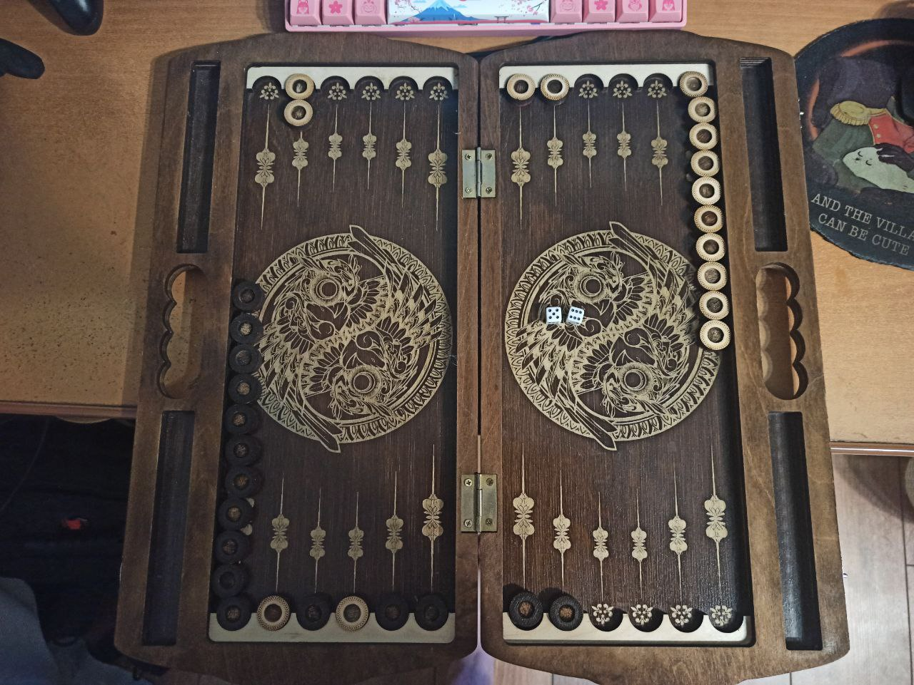
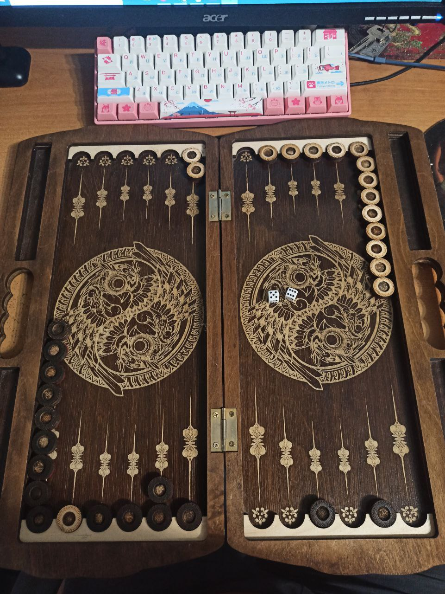
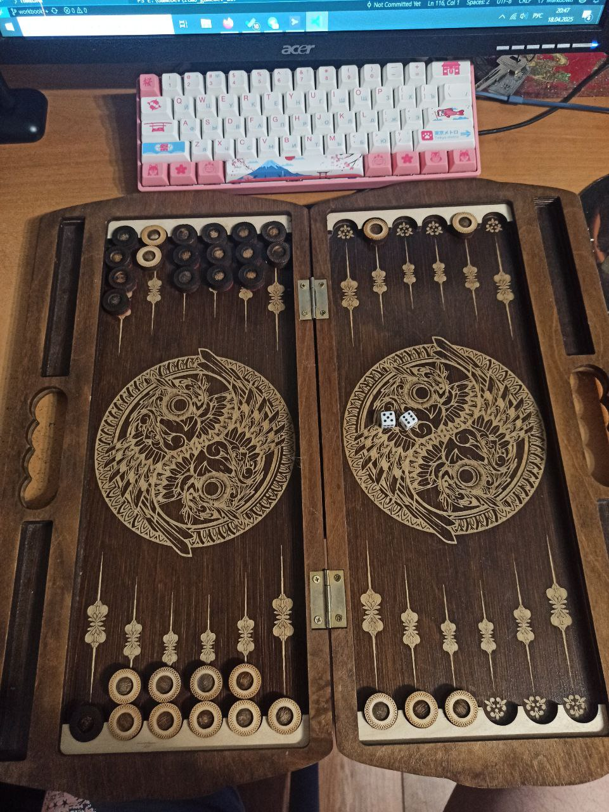

# Практическая работа 1

Выполнил студент (НИУ ВШЭ)
- Кудасов Максим Игоревич, группа ФВGDИИ 1.1

## Задание 1

### Описание задания

Палочки. Произведите анализ игры “Палочки” со следующими правилами: Перед 2 игроками лежит 31 палочка на столе, за один ход игрок может взять 1,3 или 4 палочки. Проигрывает тот, кто забирает последнюю палочку со стола. Какой игрок победит при условии, что каждый игрок придерживается оптимальной стратегии (игрок №1 ходит первым, №2 вторым)?

### Решение

Пойдём от обратного.

Разберём каждый вариант отдельно, пытаясь найти закономерность. Отталкиваться будем от того, что палочки в данный момент у первого игрока. Для второго игрока исходы зеркальны (там, где у первого -- победа, у второго игрока -- проигрыш, и наоборот).

- 1 -- поражение (вынужден взять | терминальная).
- 2 -- победа (берёт 1 | противник с 1).
- 3 -- поражение (брать 3 нельзя, если брать 1, то противник с 2 палочками).
- 4 -- победа (берёт 3 | противник с 1).
- 5 -- победа (берёт 4 | противник с 1).
- 6 -- победа (берёт 3 | противник с 3).
- 7 -- победа (берёт 4 | противник с 3).
- 8 -- поражение (противник с 7, 5 или 4).
- 9 -- победа (берёт 1 | противник с 8).
- 10 -- поражение (противник с 9, 7 или 6).
- 11 -- победа (берёт 1 | противник с 10).
- 12 -- победа (берёт 4 | противник с 8).
- 13 -- победа (берёт 3 | противник с 10).
- 14 -- победа (берёт 4 | противник с 10).
- 15 -- поражение (противник с 14, 12 или 11).
- 16 -- победа (берёт 1 | противник с 15).
- 17 -- поражение (противник с 16, 14 или 13).
- 18 -- победа (берёт 1 | противник с 17).

Этого уже достаточно для того, чтобы увидеть закономерность:
- 1, 3 -- поражение.
- 2, 4--7 -- победа.
- 8, 10 -- поражение.
- 9, 11--14 -- победа.

Итого, чтобы первый игрок проиграл, надо, чтобы искомое число было равно одному из двух исходов: $(1 + 7*x)$ или $(3 + 7*x)$ при $x = 0, 1, 2...$

Число $31 = 3 + 7*4$, то есть в данном случае первый игрок проиграет, если оба игрока будут играть оптимально.

**Ответ**: выиграет Игрок 2.

## Задание 2

### Описание задания

Альфа-бета отсечения. Придумайте некоторое дерево игры (как было в лекции), убедитесь на примере в утверждении “Альфа-бета процедура всегда приводит к тому же результату (наилучшему ходу), что и простая минимаксная процедура той же глубины”. Для этого: итеративно проиграйте это дерево с помощью альфа-бета отсечения. Затем: проверьте результат минимаксной процедурой на полном дереве.

### Решение

## Задание 3

### Описание задания

СОФ.
1) Выберите и проанализируйте игру;
2) Предложите СОФ для этой игры;
3) Возьмите несколько (3-4) ситуаций игры и покажите насколько адекватна и применима предложенная СОФ. Игры (можно предложить свою): “Шашки”, “Пять в ряд”, “Лиса и гуси”, “Бридж Ит”, “Рассада”, “Так-тикль”, “ЦЗЯНЬШИДЗЫ”, “Щелк”.

### Решение

#### СОФ и его пояснение

Разбираемая игра -- Длинные Нарды (самые простые правила из нард). В данном решении стохастикой принебрежём, предположим, что играем в нарды, где соперники называют значения на своих кубиках (такая модификация есть).

СОФ для белых будет выглядеть следующим образом (пояснения позже):

$score =$
- $+10000 \cdot \text{победа\_белых}$
- $-10000 \cdot \text{победа\_чёрных}$
- $+3 \cdot (\textit{пипы\_чёрных} - \textit{пипы\_белых})$
- $+5 \cdot \sum_{i=1}^{\textit{число\_белых\_заборов}} 2^\textit{длина\_i-ого\_белого\_забора}$
- $-5 \cdot \sum_{i=1}^{\textit{число\_чёрных\_заборов}} 2^\textit{длина\_i-ого\_чёрного\_забора}$
- $-100 \cdot \text{число\_запертых\_белых}$
- $+100 \cdot \text{число\_запертых\_чёрных}$
- $+50 \cdot \text{число\_белых\_лунок\_в\_доме}$
- $-50 \cdot \text{число\_чёрных\_лунок\_в\_доме}$

Теперь пояснения.
- В нардах задача состоит в том, чтобы переместить все фишки из двора в дом (4-ая четверть), а потом из дома вывести за границы поля.
- Пипы -- это суммарное расстояние, которое должны преодолеть все фишки, чтобы их можно было вывести. На картинке ниже белым нужно провести фишки из 24-ой позиции в 1-ую, а после 1-ой уже происходит вывод.
  - Соответственно, для белой фишки на 24-ой позиции нужно пройти 24 пункта, чтобы быть выведенной за границы поля.
  - В начале у обоих соперников по 360 пипсов (пипов).
  - Чем меньше пипсов (пипов), тем лучше.

- Ставить свои фишки на фишки противника НЕЛЬЗЯ. Отсюда следует, что желательно построить побольше "заборов", через которые нельзя будет прогнать фишки. "Забор" из 6-ти фишек нельзя никак пересечь (на кубике максимальное число -- 6), поэтому он называется "глухим" или "праймом". Отсюда и вывод -- чем больше забор, тем сильно больше надо давать баллов.
  - (5 заборов по 1) или (2 забора по 1 и 4) обойти гораздо проще, чем (1 забор на 5), поэтому за первую конфигурацию будет 50 баллов, за вторую -- 90, за последнюю -- 160.

- Отдельно стоит считать число "запертых" за праймом фишек. Чем их больше, тем серьёзнее защита. Прайм без запертых фишек скорее будет означать то, что противник уже бежит выносить фишки из дому.
  - В расчётах ВСЕ заборы, перед которыми не стоят фишки противника, считаться не будут (т.к. они будут бесполезными для счёта).
- Также отдельно стоит считать занятые лунки в доме (именно сами пункты, а не число фишек), так как если занято большое число пунктов в доме, то это с большей вероятностью значит, что занести фишки *в дом* будет проще, а противнику будет тяжелее их вывести из своего двора (первая четверть доски, с которой и начинается ход).

#### Примеры применения СОФ

**Ситуация 1**
- Число белых пипсов: 303
- Число чёрных пипсов: 336
- Белые заборы: [1, 2, 1, 1, 1]
- Чёрные заборы: [1, 1, 4]
- Число запертых белых фишек: 0
- Число запертых чёрных фишек: 0
- Число белых лунок в доме: 0
- Число чёрных лунок в доме: 0

**Значение СОФ:** 59

По карте впринципе видно, что тут ещё рано говорить о каком-то стратегическом преимуществе. Белые смогли закрепиться во дворе у чёрных (дальше продвинуться по пипсам), чёрные сделали небольшой забор для того, чтобы не потерять позиции. Как игра пойдёт дальше -- неизвестно, но в целом у белых сейчас позиция чутка (и только) получше.

**Ситуация 2**

- Число белых пипсов: 325
- Число чёрных пипсов: 324
- Белые заборы: [5, 2, 1]
- Чёрные заборы: [1, 4, 1, 1]
- Число запертых белых фишек: 0
- Число запертых чёрных фишек: 0
- Число белых лунок в доме: 0
- Число чёрных лунок в доме: 0

**Значение СОФ:** 77

Тут ситуация похожая с прошлой, только чутка иная -- в данном случае по пипсам паритет, и в то же время белые себе смогли сделать 5-ти размерный забор, в котором не смогут высадиться чёрные, а чёрные сделали только 4-х размерный. СОФ выдала в целом хорошее значение.

**Ситуация 3**

- Число белых пипсов: 170
- Число чёрных пипсов: 112
- Белые заборы: [1, 1, 1, 1, 1, 4]
- Чёрные заборы: [1, 1, 1, 1, 1, 4]
- Число запертых белых фишек: 0
- Число запертых чёрных фишек: 0
- Число белых лунок в доме: 4
- Число чёрных лунок в доме: 5

**Значение СОФ:** -304

Тут достаточно очевидное преимущество чёрных. У белых нет ни хорошего забора, ни по пипсам не догоняет, ни в дом не смогли занести большее число фишек (а у чёрных большая часть фишек именно в доме). Тут функция выдаёт очевидное преимущество чёрных, которое врядли поменяется даже к концу игры, которое уже близко.

**Ситуация 4**

- Число белых пипсов: 169
- Число чёрных пипсов: 76
- Белые заборы: [1, 1, 1, 8]
- Чёрные заборы: [1, 4, 1]
- Число запертых белых фишек: 0
- Число запертых чёрных фишек: 1
- Число белых лунок в доме: 3
- Число чёрных лунок в доме: 5

**Значение СОФ:** 931

Тут ситуация интереснее.

Чёрные сильно обгоняют по пипсам, почти все фишки в доме, кроме 1-ой. Но вот эта одна фишка не позволит закончить игру, пока её противник не занесёт в дом. Но у белых стоит заборище на 8 пунктов на весь двор + дом белых в подарок, оттого шансов на победу у чёрных становится сильно меньше -- у них ведь нет похожих заборов, соответственно белые будут насколько можно затягивать с разбором забора, до той степени, что чёрные смогут СДВИНУТЬ фишку с места только в момент, когда белые будут выносить свои фишки с поля, т.е. это уже почти гарантированно победа белых.

А пока этого не произошло, всё, что будут делать чёрные -- пытаться не разрушить свой забор вынужденными ходами, которые у них возникнут из-за того, что некуда будет "сливать" ходы во время очереди. А если появится больше брешей в защите, то и белым будет проще оставшиеся 2 фишки довести до дома.
